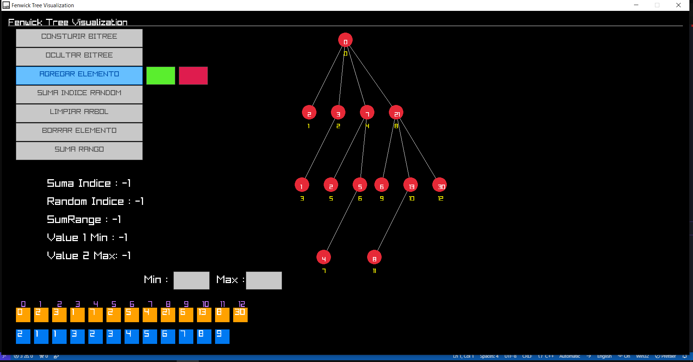

# FenwickTreeVisualization
## Author:
- `**New Ren TL (Sierpe)**`
---
## Fenwick Tree (Árbol de Fenwick):

El Fenwick Tree, también conocido como árbol BIT (Binary Indexed Tree), es una estructura de datos eficiente diseñada para realizar operaciones de suma acumulativa en un conjunto de elementos, especialmente útil para actualizar y consultar rangos de datos en un arreglo de manera eficiente.

**Características clave:**
- Eficiencia en operaciones de suma acumulativa.
- Optimizado para actualizaciones y consultas en rangos específicos.
- Utilizado en problemas de programación competitiva y optimización.

## Raylib - Librería Gráfica:

Raylib es una librería gráfica y de juegos escrita en C, diseñada para ser simple y fácil de usar. Destaca por su rendimiento y versatilidad, siendo adecuada tanto para principiantes como para desarrolladores experimentados.

**Características destacadas:**
- Soporte multiplataforma: Windows, Linux, macOS, Android, y más.
- Orientada a la simplicidad y eficiencia.
- Funciones para gráficos 2D y 3D, entrada de usuario, sonido, y más.
- Documentación completa y activa comunidad de usuarios.

## Functions and Classes

### `Pair` (estructura)

Esta estructura representa un par de elementos de tipo `T` y `K`.

### `FenwickTree` (clase)

Una implementación de un árbol de índices binarios (Fenwick Tree) con capacidades de visualización en una interfaz gráfica.

#### Métodos Privados:

- `FindNextIndexBITLessSignificant(int index)`: Encuentra el siguiente índice que tiene el bit menos significativo.
- `FindPrevIndexBITLessSignificant(int index)`: Encuentra el índice anterior que tiene el bit menos significativo.
- `g(int i)`: Función auxiliar para calcular el bit menos significativo.
- `parentIsExists(int i)`: Verifica si el nodo padre ya existe.
- `searchLevel(int levelY)`: Encuentra en qué nivel se encuentra el nodo en el eje Y.

#### Métodos de Construcción:

- `ConstructionBITree(std::vector<int> sourceArray)`: Construye el Fenwick Tree y realiza configuraciones para la visualización.
- `reConstruction()`: Reconstruye el Fenwick Tree después de cambios en el array original.

#### Métodos Públicos:

- `FenwickTree(int size)`: Constructor que inicializa un Fenwick Tree con un tamaño dado.
- `FenwickTree(int size, std::vector<int> &sourceArray)`: Constructor que inicializa un Fenwick Tree con un tamaño y un array dado.
- `update(int index, int delta)`: Actualiza el valor en un índice dado con un delta específico.
- `prefixSum(int index)`: Calcula la suma acumulativa hasta el índice dado.
- `isEmptyArrayOrigin()`: Verifica si el array original está vacío.
- `push(int value)`: Añade un elemento al array original y reconstruye el Fenwick Tree.
- `pop()`: Elimina el último elemento del array original y reconstruye el Fenwick Tree.
- `getTree()`: Obtiene el árbol Fenwick actual.
- `calculando_CoordenadasDibujo()`: Calcula las coordenadas para la visualización del Fenwick Tree.
- `cleanDraw()`: Limpia todos los vectores relacionados con la visualización.
- `Dibujar()`: Dibuja el Fenwick Tree en una interfaz gráfica.
- `getArrayOrigin()`: Obtiene el array original.
- `getArrayOriginColors()`: Obtiene los colores asociados al array original.
- `setColorArrayOrigin(Color color, int index)`: Establece el color de un elemento específico en el array original.
- `coloringLabels()`: Colorea los nodos que han sido utilizados en operaciones de suma (prefix sum).
- `cleanColoring()`: Restaura los colores originales del array original y nodos.
- `getN()`: Obtiene el tamaño del Fenwick Tree.
- `range_query(int left, int right)`: Realiza una consulta de rango (suma de elementos en un rango dado).
## Preview Image of Fenwick Tree Visualization GUI 

